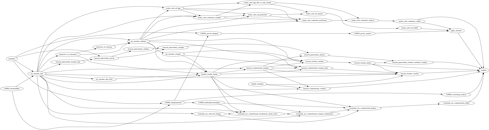

# Overview

This repository contains the code underlying the article Spatial Economics for Granular Settings by Jonathan I. Dingel and Felix Tintelnot.
This replication package produces all exhibits from scratch,
beginning with scripts in [`initialdata`](initialdata/code/Makefile) and [`LODES_downloaddata`](LODES_downloaddata/code/Makefile) that download all the required data.

## Acknowledgments

We are grateful to Junbiao Chen, Daniil Iurchenko, Reigner Kane, Leran Qi, John Ruf, Isaac Shon, Ye Sun, Linghui Wu, Shijian Yang, and Mingjie Zhu for excellent research assistance in producing this content.

## Data availability statement

All data used in this study are publicly available from government sources or other researchers' replication packages. A description of the specific datasets employed in the paper, how they were obtained, and the relevant variables can be found in Appendix D.7 of the article.

The task folders that retrieve data are `LODES_downloaddata`, `initialdata`, and `CDP_PUMS_data`. Each of these tasks contains a `Makefile` within the `code` sub-directory that retrieves the data. In addition, each task contains a README file that briefly describes the data that is downloaded.

## Code organization

The workflow is organized as a series of tasks.
Each task folder contains three folders: `input`, `code`, `output`.
A task's output is used as an input by one or more downstream tasks.

The repo contains 98 task folders.
[The task graph](task_graph/output/task_flow.png) depicts the input-output relationships between tasks.
The following subgraph depicts the 51 task folders involved in producing all the exhibits appearing in the main text of the paper.
Notice that the `exhibits` folder is the most downstream task.
Tasks that are one step upstream from the `exhibits` task produce tables, figures, or numbers that appear in exhibits;
further upstream tasks produce output files that these tasks use as inputs.



We use the [`make`](http://swcarpentry.github.io/make-novice/) utility to automate this workflow.
After downloading this replication package (and installing the relevant software), you can reproduce the figures and tables appearing in the paper simply by typing `make` at the command line.
*We strongly encourage use of Make and advise against running tasks manually* (if you wish to do so, see "Running tasks manually" below).

## Replication instructions

### Download

Clone (or download) this repository by clicking the green `Code` button above.
If downloading, uncompress the ZIP file into a working directory on your cluster or local machine.

### Software requirements
The project's tasks are implemented via Julia, Matlab, R, Stata, and shell scripts.
We ran our code using Julia 1.10.2, Matlab 2023b, R 4.1, Stata 18, GNU bash version 3.2.57, GNU Make 3.81, and ImageMagick 7.1.1-47.
The taskflow structure employs [symbolic links](https://en.wikipedia.org/wiki/Symbolic_link).

The Makefiles rely on `shell_functions.sh`, which assumes that `julia`, `matlab`, `Rscript`, and `stata-se` are valid commands on your machine.
Please create appropriate aliases or edit `shell_functions.sh` (e.g., replace `stata-se` with `stata-mp`).

If using a computing cluster with SLURM job scheduling, customize `setup_environment/code/run.sbatch` with your credentials as required.
You should also edit the `module load` commands in `shell_functions.sh` if your software versions differ from those listed above.

Before reproducing research results, you need to install the required Julia, R, and Stata packages.
From the Unix/Linux/MacOSX command line, navigate to the directory `setup_environment/code`.
Type `make` to install required Julia, R, and Stata packages.
- `setup_environment/output/Project.toml` lists the 29 Julia packages used in this project
- `setup_environment/code/packages.R` lists the 9 R packages used in this project
- `setup_environment/output/stata_requirements.txt` lists the 14 Stata packages used in this project

Please note that an internet connection is required when running the `setup_environment`, `initialdata`, `LODES_downloaddata`, and `CDP_PUMS_data` tasks. 

### Running scripts

You might use this replication package to do three things:
- Compile a PDF of the exhibits in the paper or compile the paper PDF
- Reproduce research results from intermediate data
- Reproduce research results from scratch

#### Compile PDFs

From the Unix/Linux/MacOSX command line, navigate to the directory `exhibits/code`.
If you type `make`, it will build the paper PDF and a PDF containing the exhibits,
using the exhibit files from tasks' output folders.
(This assumes `pdflatex` is a valid command and you have installed the LaTeX packages listed in `paper.tex` and `exhibits.tex`.)

#### Reproduce research results from intermediate data

To facilitate reproduction of the main-text exhibits without having to run everything from scratch,
we provide output files for the following tasks:
Amazon_counterfactual_dispersion_simulation,
Amazon_fixednu_analyze,
Amazon_fixednu_analyze_NTA,
Amazon_fixednu_analyze_nested,
Amazon_fixednu_distance_bins,
Amazon_puncertainty_analysis,
eventstudy_nyc_counterfactual_analyze,
ex_post_regret,
interactive_fe_estimation,
interactive_fe_reformat,
monte_carlo_continuum_analysis,
monte_carlo_iid_analysis.

Several intermediate output files are provided in the form of `.zip` files. To use them, first decompress the files by running: `for i in 1 2 3; do unzip ./interactive_fe_reformat/output/nyc2010_lambda_ife_${i}.dta.zip -d ./interactive_fe_reformat/output/; done` This will extract the contents into their respective task's output folders so they can be used in downstream tasks.

To reproduce the main-text exhibits from these intermediate output files,
run the following command in this folder (the folder containing this `README.md` file) to delete all exhibits (except those in `Amazon_fixednu_analyze`):
```
rm $(ls ./*/output/*.{eps,png,tex} | grep -v Amazon_fixednu_analyze)
```
Then, type `make ../output/exhibits_maintext.pdf` in `exhibits/code`
to run upstream tasks to produce the main-text exhibit PDFs but use the provided intermediate outputs where available.


#### Reproduce research results from scratch

To reproduce all research results from scratch, run `rm $(ls ./*/output/*.{csv,dta,zip,eps,png,tex} | grep -v 'initialdata\|CDP_PUMS_data\|task_graph')`
in this folder (the folder containing this `README.md` file) to delete all output files.

If you run `make ../output/exhibits_maintext_fast.pdf` in `exhibits/code`, it 
will generate all exhibits that do not rely on the most computationally intensive tasks.
This omits Figure 2, Figure 5, Table 2, Figure 7 panel B, and Figure 8.
`exhibits_maintext_fast.pdf` can be produced from scratch in less than two hours.
We recommend running this first before producing all exhibits.

If you type `make` in `exhibits/code`,
it will run upstream tasks in order to produce the files containing the exhibits.
You can produce the outputs of any individual task by running `make` in that task's `code` folder,
akin to running the `exhibits` task.

Make supports parallel processing and each task is parallelizable.
To run all tasks from most upstream to most downstream in the correct order leveraging parallel processing,
run `make -f parallel.make THREADS=50` in this folder, where `50` is the number of threads available on your machine or cluster.
(Running `make -j 50` in `exhibits/code` does not work cleanly because common upstream inputs will be redundantly produced by different threads and may conflict.)

### Data download verification

The `output` (and `temp`) folders of the `initialdata`, `LODES_downloaddata`, and `CDP_PUMS_data` tasks are large (245MB, 2.2GB, and 764MB),
so we do not commit these files to the replication repo.
To verify that the files you download from the original data providers match those we used,
run `make verify_downloads` to compare their MD5 hashes to those in the `report` folder.

### Computation time
Some of the tasks are quite slow and take hundreds of CPU hours to run:
`Amazon_fixednu_simulate`, `interactive_fe_estimation`, and the various Monte-Carlo simulations.
We have committed files to various tasks' output folders,
so that downstream tasks can use those intermediate output files without having to run tasks requiring hundreds of CPU hours.
See "Reproduce research results from intermediate data" above.

The time required to run each task is reported within `metadata/time.txt` inside each task folder. 
For most tasks, we report precise run times for a 2021 iMac with an Apple M1 chip and 16GB RAM.
These metadata files contain two lines:
- **real**: the elapsed “wall-clock” time (i.e., how long the task took to complete).
- **user**: the total CPU time spent on the task, summed across all cores.

For tasks that run in parallel on a high-performance computing cluster, we report approximations of the total number CPU hours.
These are based on running jobs on Columbia University's Shared Research Computing Facility,
which has Intel Xeon Platinum 8460Y 2 Ghz processors.
For example, we report that the `monte_carlo_continuum_predictions` task takes about 247 CPU hours.
Because this task produces 100 simulations for each of 13 parameter vectors, it can be run in parallel.
Typing `make -j 100` would launch 100 parallel processes, and the task would complete in about 2.5 hours.

Our default allocation in `run.sbatch` is 5GB of memory for a script.
Many scripts use much less than 5GB of memory.

A table listing the computation time for each task can be found
[here](task_computation_times.md).


## List of exhibits
A table listing the outputs and task folders associated with each figure and table found in the main text and appendices can be found
[here](exhibits/output/exhibits_table.md).


Each row of the table represents a particular file used in an exhibit and the task used to generate the file.
Note that several figures combine multiple outputs generated in separate tasks.

## Running tasks manually
We strongly encourage the use of the `make` utility to run scripts. A Makefile is a directed acyclic graph that defines the dependencies between tasks and automates the execution of tasks in the correct order. This project involves more than 15,000 lines of code: 144 Stata scripts, 82 Julia scripts, 7 R scripts, and 5 Matlab scripts. The scripts take arguments: for example, one script runs hundreds of Monte Carlo simulations by taking the parameter values for the simulation as command-line arguments. Doing this without Make would be error-prone and tedious.

Consider the following example: 
after downloading the LODES data, we run the `LODES_datapreparation` task to aggregate from blocks to tracts for each city and year.
The `make -n` output below indicates the sequence of scripts and arguments that would be executed automatically by typing `make` in `LODES_datapreparation/code`:

```
code % make -n
ln -sf ../../LODES_downloaddata/output/mi_od_main_JT01_2009.csv ../input/mi_od_main_JT01_2009.csv
STATA DetroitUA_tract.do 2009
ln -sf ../../LODES_downloaddata/output/mi_od_main_JT01_2010.csv ../input/mi_od_main_JT01_2010.csv
STATA DetroitUA_tract.do 2010
ln -sf ../../LODES_downloaddata/output/mi_od_main_JT01_2011.csv ../input/mi_od_main_JT01_2011.csv
STATA DetroitUA_tract.do 2011
ln -sf ../../LODES_downloaddata/output/mi_od_main_JT01_2012.csv ../input/mi_od_main_JT01_2012.csv
STATA DetroitUA_tract.do 2012
ln -sf ../../LODES_downloaddata/output/mi_od_main_JT01_2013.csv ../input/mi_od_main_JT01_2013.csv
STATA DetroitUA_tract.do 2013
ln -sf ../../LODES_downloaddata/output/mi_od_main_JT01_2014.csv ../input/mi_od_main_JT01_2014.csv
STATA DetroitUA_tract.do 2014
ln -sf ../../LODES_downloaddata/output/ny_od_main_JT01_2002.csv ../input/ny_od_main_JT01_2002.csv
ln -sf ../../initialdata/output/2015_gaz_tracts_36.txt ../input/2015_gaz_tracts_36.txt
ln -sf ../../initialdata/output/NYC_tractpairs_DDMM.dta ../input/NYC_tractpairs_DDMM.dta
STATA NYC_tract.do 2002
ln -sf ../../LODES_downloaddata/output/ny_od_main_JT01_2003.csv ../input/ny_od_main_JT01_2003.csv
STATA NYC_tract.do 2003
ln -sf ../../LODES_downloaddata/output/ny_od_main_JT01_2004.csv ../input/ny_od_main_JT01_2004.csv
STATA NYC_tract.do 2004
ln -sf ../../LODES_downloaddata/output/ny_od_main_JT01_2005.csv ../input/ny_od_main_JT01_2005.csv
STATA NYC_tract.do 2005
ln -sf ../../LODES_downloaddata/output/ny_od_main_JT01_2006.csv ../input/ny_od_main_JT01_2006.csv
STATA NYC_tract.do 2006
ln -sf ../../LODES_downloaddata/output/ny_od_main_JT01_2007.csv ../input/ny_od_main_JT01_2007.csv
STATA NYC_tract.do 2007
ln -sf ../../LODES_downloaddata/output/ny_od_main_JT01_2008.csv ../input/ny_od_main_JT01_2008.csv
STATA NYC_tract.do 2008
ln -sf ../../LODES_downloaddata/output/ny_od_main_JT01_2009.csv ../input/ny_od_main_JT01_2009.csv
STATA NYC_tract.do 2009
ln -sf ../../LODES_downloaddata/output/ny_od_main_JT01_2010.csv ../input/ny_od_main_JT01_2010.csv
STATA NYC_tract.do 2010
ln -sf ../../LODES_downloaddata/output/ny_od_main_JT01_2011.csv ../input/ny_od_main_JT01_2011.csv
STATA NYC_tract.do 2011
ln -sf ../../LODES_downloaddata/output/ny_od_main_JT01_2012.csv ../input/ny_od_main_JT01_2012.csv
STATA NYC_tract.do 2012
ln -sf ../../LODES_downloaddata/output/ny_od_main_JT01_2013.csv ../input/ny_od_main_JT01_2013.csv
STATA NYC_tract.do 2013
ln -sf ../../LODES_downloaddata/output/ny_od_main_JT01_2014.csv ../input/ny_od_main_JT01_2014.csv
STATA NYC_tract.do 2014
ln -sf ../../LODES_downloaddata/output/ny_od_main_JT01_2015.csv ../input/ny_od_main_JT01_2015.csv
STATA NYC_tract.do 2015
ln -sf ../../LODES_downloaddata/output/ny_od_main_JT01_2016.csv ../input/ny_od_main_JT01_2016.csv
STATA NYC_tract.do 2016
ln -sf ../../LODES_downloaddata/output/ny_od_main_JT01_2017.csv ../input/ny_od_main_JT01_2017.csv
STATA NYC_tract.do 2017
ln -sf ../../LODES_downloaddata/output/wi_od_main_JT01_2010.csv ../input/wi_od_main_JT01_2010.csv
ln -sf ../../LODES_downloaddata/output/wi_od_aux_JT01_2010.csv ../input/wi_od_aux_JT01_2010.csv
ln -sf ../../LODES_downloaddata/output/mn_od_aux_JT01_2010.csv ../input/mn_od_aux_JT01_2010.csv
ln -sf ../../LODES_downloaddata/output/mn_od_main_JT01_2010.csv ../input/mn_od_main_JT01_2010.csv
STATA MSP_tract.do 2010
ln -sf ../../LODES_downloaddata/output/wi_od_main_JT01_2013.csv ../input/wi_od_main_JT01_2013.csv
ln -sf ../../LODES_downloaddata/output/wi_od_aux_JT01_2013.csv ../input/wi_od_aux_JT01_2013.csv
ln -sf ../../LODES_downloaddata/output/mn_od_aux_JT01_2013.csv ../input/mn_od_aux_JT01_2013.csv
ln -sf ../../LODES_downloaddata/output/mn_od_main_JT01_2013.csv ../input/mn_od_main_JT01_2013.csv
STATA MSP_tract.do 2013
ln -sf ../../LODES_downloaddata/output/wi_od_main_JT01_2014.csv ../input/wi_od_main_JT01_2014.csv
ln -sf ../../LODES_downloaddata/output/wi_od_aux_JT01_2014.csv ../input/wi_od_aux_JT01_2014.csv
ln -sf ../../LODES_downloaddata/output/mn_od_aux_JT01_2014.csv ../input/mn_od_aux_JT01_2014.csv
ln -sf ../../LODES_downloaddata/output/mn_od_main_JT01_2014.csv ../input/mn_od_main_JT01_2014.csv
STATA MSP_tract.do 2014
```

As shown above, the `LODES_datapreparation` task uses the data downloaded by the `initialdata` and `LODES_downloaddata` tasks as inputs.
To do this manually, one would need to run the `ln -sf` commands above to create symbolic links to the 36 files (or copy the 36 files to the `LODES_datapreparation/input` folder).
Next, there are 25 runs of three distinct Stata scripts.
Each Stata script takes in one command-line argument: the year. 
The manual replicator must run each script for every argument specified in the `make -n` listing,
either from the command line or by typing commands like `do MSP_tract.do 2013` in an interactive Stata session.

In other tasks, scripts may require several additional arguments and must be run hundreds or thousands of times.
When running scripts manually, the replicator must ensure that these arguments match exactly those listed in the `make -n` output.
Executing the scripts in this order reproduces precisely what the `make` utility would have done automatically.

Before running a downstream task, one must run the other tasks upstream of it in order to produce the required inputs.
Our Makefiles do this automatically.
Typing `make` in the `exhibits/code` directory will run the entire project from start to finish, executing everything in the correct order.
